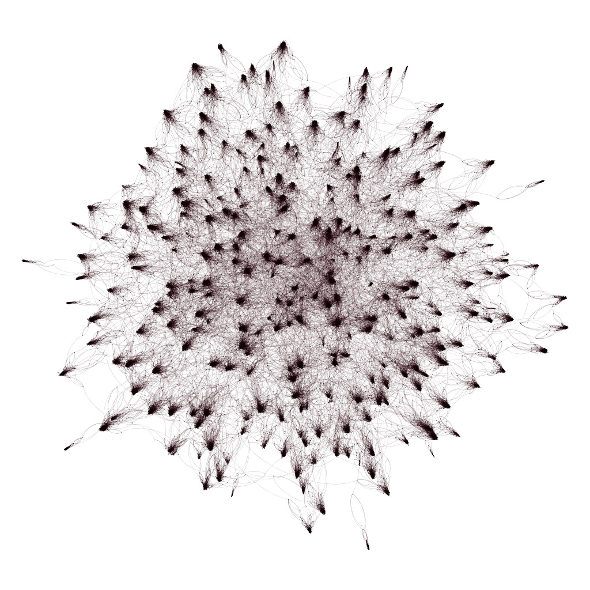
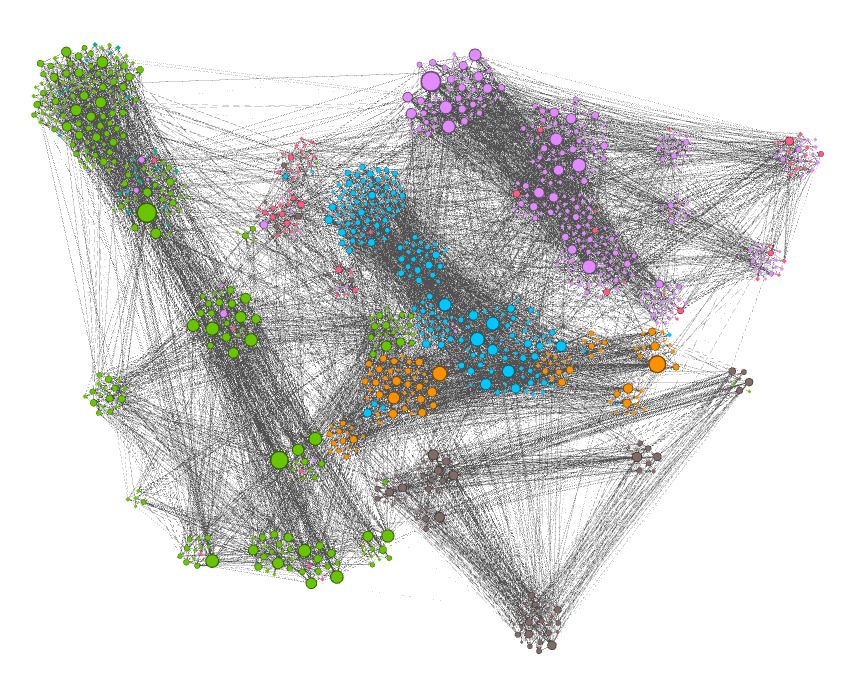

# Graph Visualization with Gephi
by Alex Razoumov

## Intro

1. **Scientific visualization** in traditional computational sciences http://bit.ly/cctopviz.
2. Graph/network visualization falls more into the **information visualization** category, deals with
   visual representation of a network of connected (and often non-numerical) items.

Common uses of graph visualizations:
* biology: evolutionary trees, interactions between individuals, disease transmission, sequence
  similarity, metabolic pathways, protein interactions, pathways, regulatory cascades, gene expression,
  etc
* society: social networks, family trees, linked pages on the internet
* machine learning: decision trees
* bibliographic or citation databases
* computational text analysis

Gephi https://gephi.org is a network/graph analysis and visualization tool.
* open source
* 2D
* interactive exploration of networks up to tens of thousands of nodes
* GPU acceleration to speed up rendering
* includes many highly configurable force-directed layout algorithms
* built-in metrics to measure graphs (centrality measures, density, clustering coefficients, path
  lengths, modularity, etc)
* can assign various attributes to nodes and links

One of many network visualization packages
- http://www.cytoscape.org is also open source; originally designed for biological research (can
  integrate with annotations, gene expression profiles, etc); now used widely outside biology
- various Python and R libraries, e.g., http://networkx.github.io for Python, or igraph and networkD3 in R

Runs on top of Java
* plus: single code base, can be run in Linux, Windows, Max
* annoying: not very efficient, needs a separate Java RE install
* annoying: does not observe OS-wide UI settings (trackpad speed, etc), misbehaves after sleep

Supported file formats https://gephi.org/users/supported-graph-formats: GEXF, GDF, GML, GraphML,
PajekNET, GraphVizDOT, CSV, UCINETDL, TulipTPL, NetdrawVNA, Spreadsheet

Third-party implementations of scripting for Gephi:
* **Gephi toolkit** is a Java API to Gephi modules
* **Scripting Plugin** uses Python inside JVM (aka *Jython* implementation of Python) to access Gephi
  Java APIs -- seems to be no longer available via Tools -> Plugins; for details see
  https://gephi.wordpress.com/2012/05/14/python-scripting-console-for-gephi/

## Definitions

* Vertices = nodes, and edges = links = connections
* Directed (vs. undirected) graph: edges have directions, e.g., in a family tree could have an arrow from
  a parent to a child

## Dataset 1: algorithmically generated network

* long links: every number is linked to its square
* short links: every number in a group is linked to two other random numbers in the same group
* long links: link two random nodes globally, repeat specified number of times

The code *numbers.py* is listed below:
~~~{.python}
#!/usr/bin/env python

numberOfGroups = 15    # the number of nodes is (numberOfGroups+1)**2-1
numberOfLongConnections = 100   # number of completely random long edges

# network contribution #1: almost isolated communities
numberOfNodes = (numberOfGroups+1)**2 - 1
from random import choice
for i in range(1,numberOfGroups+1):
    square = i**2
    nextSquare = (i+1)**2
    print(i,';',square,sep='')
    for j in range(square,nextSquare):
        group = list(range(square,nextSquare))
        group.remove(j)
        a1 = choice(group)
        group.remove(a1)
        a2 = choice(group)
        group.remove(a2)
        print(j,';',a1,';',a2,sep='')

# network contribution #2: completely random long edges
if numberOfLongConnections > 0:
    allPoints = list(range(1,numberOfNodes))
    for i in range(numberOfLongConnections):
        a = choice(allPoints)
        allPoints.remove(a)
        b = choice(allPoints)
        allPoints.remove(b)
        print(a,';',b,sep='')
~~~

Let's try numberOfGroups = 6 and numberOfLongConnections = 0. This will give us
(numberOfGroups+1)**2-1 = 48 nodes and 102 edges.

~~~{.bash}
$ ./numbers.py > numbers.csv
~~~

Let's open this file in Gephi and walk through its GUI: Overview, Data Laboratory, Statistics, Context.

* Layout -> Circular Layout
* Layout -> Dual Circle Layout with 15 points on the inner circle
* Go through various ways to zoom in/out: trackpad, slider, Contraction/Expansion Layouts, Centre-On-Graph button

1. In Overview -> Appearance panel set Nodes + Colour + Unique to light blue.
2. In Overview -> Appearance panel set Edges + Colour + Unique to black.
3. In Overview -> Appearance panel set Nodes + Size + Attribute to Degree from 2 to 10.
4. In Graph slide up label the nodes, make the edges thinner.

#### Force-directed layouts

1. Linked nodes attract each other.
2. Non-linked nodes are pushed apart.

Fruchterman-Reingold force-directed layout (more space within a decided area)
* repulsive between every pair of vertices proportional to  area
* attractive forces along edges proportional to 1/sqrt(area)
* gravity attracts all nodes to the center

ForceAtlas2 force-directed layout (disperse groups with space around larger nodes)
* repulsive between every pair of vertices proportional to scaling
* attractive forces along edges proportional to distance (not adjustable)
* gravity attracts all nodes to the center

#### Graph analysis (various centrality measures)

* degree centrality = number of connections (already saw this one)
* closeness centrality = inverse average distance to all other nodes
* betweenness centrality = number of times a node is sitting on a shortest path
* eigenvector centrality = connection to well-connected nodes

In Overview -> Statistics panel compute Eigenvalue Centrality. In Data Laboratory -> Data Table for nodes
see the new column Eigenvalue Centrality. In Overview -> Appearance panel colour nodes (Nodes + Color +
Attribute) colour nodes by Eigenvalue Centrality with a reverse colour map (smaller circles in dark, to
make them more visible).

* large nodes have high degree (many connections)
* light nodes have high eigenvalue centrality (connected to many important nodes)
* the two are not exactly correlated!

In Overview -> Statistics panel compute Modularity with resoluton=1. In Overview -> Appearance panel set
Nodes + Colour + Attribute to Modularity Class. The dataset is now coloured by the group, with ~5 groups
(communities). Lower resolution=0.5 produces more groups.

Let's rebuilt our graph with numberOfGroups = 15 and numberOfLongConnections = 0. This will produce 255
nodes and 525 edges. Run Layout -> Force Atlas 2.

Let's rebuilt our graph with numberOfGroups = 15 and numberOfLongConnections = 100. This will produce 255
nodes and 625 edges. Run Layout -> Force Atlas 2.

* colour nodes by Modularity Class (should be ~groups)
* size nodes by Degree from 2 to 12
* mouse over nodes to see their connections

Preview -> Refresh and then save as PNG at 2000x2000. Now add labels.

#### Filters

In Overview bring up a Window -> Filters panel.

* Filters -> Attributes -> Range -> Modularity Class will keep a range of groups.
* Filters -> Attributes -> Equal -> Modularity Class will show only one group.

#### Large scale

Let's rebuilt our graph with numberOfGroups = 50 and numberOfLongConnections = 300. This will produce 2600
nodes and 5550 edges.

* Run Fruchterman-Reingold layout - it'll run very slowly. Increase the speed. Wait for convergence.
* In Overview -> Statistics panel compute Modularity with resoluton=1 => ~35 groups.
* Colour nodes by Modularity Class. Size by Degree. Run Fruchterman-Reingold again.
* Make edges thicker, colour them with node colour.
* Run Layout -> Force Atlas 2 -- groups are fairly weakly connected.
* Try to save the graph as PNG at 

We can also generate graphs with File -> Generate -> Random Graph. Try 1000 nodes and 0.01 wiring
probability.

#### Extreme scale

NumberOfGroups = 300 and numberOfLongConnections = 1000. This will produce 90,600 nodes and 182,500
edges. Takes few minutes to converge on my laptop.

## Dataset 2: geographical network

#### Importing data

We will look at a geographical network of 1000 individuals sending letters all over Europe -- the dataset
is taken from the blog http://www.martingrandjean.ch/gephi-introduction. You can find the actual data
files at http://bit.ly/1pw1l2c (nodes) and http://bit.ly/1S1DH4I (edges).

File -> Import Spredsheet to load Nodes1.csv as "nodes table" (make sure Latitude/Longitude are loaded as
Double) and Edges1.csv as "edges table". Inspect the data in Data Laboratory -> Data Table.

#### Few force-directed layouts

In Overview -> Appearance panel set Nodes + Size + Attribute to Degree to 10-60 (size by Degree
Centrality = number of connections) and Nodes + Color + Attribute to Degree as well in reverse.

In Overview -> Appearance panel set Edges + Color + Unique to grey.

Run Fruchterman-Reingold layout until convergence.

Run Force Atlas 2 layout until convergence. Try with/without Prevent Overlap.

Colour nodes by Eigenvector Centrality. Then by Modularity Class. Turn labels on.

Zoom in, inspect connections.

In Preview -> Preview Settings, click Show Labels, and then Refresh, and then Export as SVG. Open
europe.svg in Chrome browser.

#### Geographical layouts

Load GeoLayout and NoOverlap plugins (Tools -> Plugins -> Available Plugins).

In Overview -> Layout panel select Geo Layout with Latitude=Latitude, Longitude=Longitude,
Projection=Mercator and press Run

In Overview -> Layout panel select Nooverlap with ratio=0.1 and margin=0.3 to spread the nodes a little.

In Overview -> Graph panel on the left sidebar select Edit Node Attributes tool and click on any node to
display its location

Can make nodes smaller, remove labels, make links yellow or orange, and in a separate image-editing
program overlay the saved network onto a dark map
http://www.martingrandjean.ch/wp-content/uploads/2015/10/Mapbase.svg for a cool effect.

## Summary

There are good tutorials on the Gephi website:
* https://gephi.org/users/quick-start
* https://gephi.org/users/tutorial-visualization
* https://gephi.org/users/tutorial-layouts

You can find a copy of these slides at http://bit.ly/gephibits.
